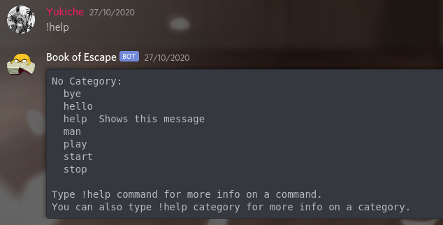

<h1 align="center">
    Workshop - Bot Discord
</h1>

<p align="center">
    
</p>
<br>

<h3 align="center">
    The objective of this workshop is to learn how to <br> create a Discord bot with Python Discord's API.
</h3>
<br><br>

### **What's Discord?**

Discord is a social application / website where everyone can create communication server. <br>
Discord is reputated for these bots, they are used for adding functionalities, adding games and a lot of other things. <br> One of the most famous is Danker Memer, which is actually present on more than three millions servers.<br><br>

### **What's a bot?**
A bot is an autonomous program that can interact with systems or users. <br> There's a lot of bot such as chatbot which can dialog with a user.<br><br>

### **What's an API?**
An API (Application Programming Interface) is a set of functions and procedures allowing the
 creation of applications <br> that access the features or datas of an operating system, applications, or services. <br>For example, the API REST Google Drive which allows you to create and share documents.<br><br>

# **Initialization**

## **Installation of Discord's API**
It is required to install the Discord API to ensure that your bot to work.

Use this command to install the API on Linux/MacOS
```python
python3 -m pip install -U discord.py
```
On Windows :
```python 
py -3 -m pip install -U discord.py
```
<br><br>

## **Creation of Discord's Application**
Now we are going to create our first application. <br>

Go on:
```
https://discord.com/developers/applications
```
<br><br>
Now click on "New Application" button, and enter your Bot name.
<br><br>


<br><br>

## **Creation of the bot's account**
You need to create your bot's account in order to set parameters (name, profile picture, ...) <br>
To do this you need to go on your application and click on "Bot" then on "Add Bot".


<br><br>

## **Adding the bot to your server**

On the OAuth2 section, we can generate an URL to adding your bot on a server. <br>
Then select Bot option on Scopes category, now you can choose permissions for your bot. <br>

> For the workshop, we advise you to give Administrator permission.

Afterwards, you need to copy the generated URL on your search bar, and select the server that you want.


<br><br>

# **First bot**

<h3>In this part, we will see how to start a simple bot.</h3>
<br>

* ## **Import Discord API** <br>
In the first time, we need to import Discord to interact with it, like below:

```python
import discord
```
<br>

* ## **Initialize Discord Client** <br>
Then, we have to initialize the Client in order to etablish a connection with Discord:
```python
client = discord.Client()
```
<br>

* ## **Implementation of a connection message** <br>
Now, the connection message must be implemented in four steps: <br><br>
1) Call the event interaction like the following line:
```python
@client.event
```
<br><br>

2) Then, define the on_ready function which will allow you to create your connection message:
```python
async def on_ready():
```
> An asynchronous function is a type of function which will allow you to execute functions at the same time.

<br> <br> 

3) Now, you can display your connection message like below:
```python
   await client.get_channel(CHANNEL_ID).send("Hello World!")
```
<br> <br> 

4) But, you need to run the Client to be connected to Discord by using your token:
The token represents the ID of your bot.
> The token is available on the bot section from your Applcation page on: https://discord.com/developers/applications
```python
client.run(TOKEN)
```
<br><br> 

> After, we have to define a prefix to permit users to execute commands, so:
> ```python
> client = commands.Bot(command_prefix='!')
> ```
> With this sample we need to tap commands with an '!' like:
> ```
> !hello
> ```
<br><br>

### You need to have this result:
```python
import discord

client = discord.Client()

@client.event
async def on_ready():
    await client.get_channel(CHANNEL_ID).send("Hello World!")

client.run(TOKEN)
```
<br><br>

# **Exercises**

<h3>And now, let's go to practice!<h3><br>

> You can find informations from the documentation at https://discordpy.readthedocs.io/en/latest/api.html.

<br>

## **Ex01 - I need help**
For this first exercise, the goal is to implement a help command, like this example: <br>

<br><br>

## **Ex02 - Spotted**
The purpose of this exercise is to set up detection message's reaction and to display "Spotted" by mentioning the user.
<br><br>

## **Ex03 - Make me admin please**
With the exercise two, you have to add the administrator role to users who made a reaction.
<br><br>

## **Ex04 - Get out of here!!!**
Now, you have to implement a command which will kick an user, but this command needs to be only executed by admin.
<br><br>

## **Ex05 - Only privileged people**
The objective is to create, with a command, a textual channel only accessible to admin.
<br><br>

## **Ex06 - Private Conspiracy**
For the last exercise, you must, with a command, send a private message to all admins.

<br><br>

# **To go further**
Now that you have the basis for creating a Discord bot, we give you some examples to improve your bot:
- Adding the possiblity to play music with the bot
- Adding a game using user's reactions
- Giving status informations
- Adding a welcoming message when a new member joins
